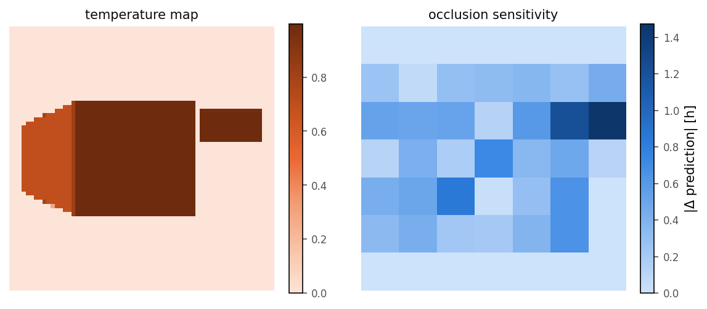

# Predictive Maintenance für Glys-Triebwerke

**Abschließende Projektarbeit — Industrial Computing (DIBSE 26), Teil 2**

Alle Zahlen stammen aus den von der Pipeline erzeugten Artefakten
([`results.json`](reports/results.json), [`experiments.csv`](reports/experiments.csv),
[`features.csv`](reports/features.csv), `web/model.json`) und sind nicht von Hand
eingetragen. Reproduktion: `docker compose up`.

---

## 0. Zusammenfassung

Aus einem Wärmebild soll die verbleibende Lebensdauer geschätzt werden. Gelöst als
**Regression** (`Dense(1, activation="linear")`, Loss `mse`), zusätzlich als
10-Stunden-Klassen dargestellt (§6.5).

**Der zentrale Befund liegt vor jeder Modellierung: die 11 Dateien enthalten nur 6
eindeutige Bilder.** Fünf Paare sind byteidentisch, tragen aber verschiedene Labels. Daraus
folgen eine beweisbare Fehleruntergrenze von **MAE 1,364 h** und die Pflicht, alle
Aufteilungen nach Bildinhalt statt nach Dateiname zu gruppieren.

| Modell | MAE [h] | Skill | Eingabe |
|---|---:|---:|---|
| **feature_mlp** (5 Seeds) | **10,77 ± 1,23** | **0,676** | Σ °C |
| isotonic | 11,68 | 0,649 | Σ °C |
| linear | 11,92 | 0,642 | Σ °C |
| monotone_mlp (5 Seeds) | 20,38 ± 0,34 | 0,388 | Konus/Körper/Pylon |
| nearest_neighbour | 22,82 | 0,314 | Σ °C |
| mean | 33,28 | 0,000 | — |
| cnn | 41,07 | −0,234 | Temperaturkarte 64×64 |
| cnn_unmasked_background | 47,01 | −0,413 | dito, Hintergrund unmaskiert |

Neuronale Zeilen sind Mittelwert ± Streuung über fünf Seeds (`results.json → seed_sweep`);
der `models`-Block derselben Datei enthält den Einzellauf mit Seed 0 (feature_mlp 9,20 h,
monotone_mlp 20,65 h), aus dem Abbildungen und Out-of-Fold-Vorhersagen stammen.

Das beste Modell ist ein Netz mit **177 Parametern** auf einem einzigen physikalischen
Merkmal. **Einordnung:** Die isotone Regression erreicht deterministisch 11,68 h; der
Vorsprung von rund 0,9 h liegt damit **innerhalb einer Standardabweichung** der
Seed-Streuung. Im Erwartungswert besser, aber bei elf Beispielen nicht sauber von
Initialisierungsrauschen zu trennen (§5.1).

---

## 1. Feature-Extraction (25 %)

### 1.1 Datenaudit

| Dateien | Labels | md5 |
|---|---|---|
| `003h` = `005h` | 3, 5 | `87558f…` |
| `024h` = `026h` | 24, 26 | `4dac2b…` |
| `047h` = `051h` | 47, 51 | `8b2bf8…` |
| `073h` = `076h` | 73, 76 | `bc54a4…` |
| `078h` = `082h` | 78, 82 | `1b3259…` |
| `100h` | 100 | `c2ee1e…` |

**Datenlecks.** Bei Aufteilung nach Dateinamen liegt beim Testen von `005h` das
pixelgleiche `003h` im Training — ein Leck, das keine Metrik anzeigt. Alle Aufteilungen
gruppieren nach md5 (`dataset.grouped_splits`).

**Fehleruntergrenze.** Identische Pixel mit verschiedenen Labels sind durch keine Funktion
des Bildes unterscheidbar; die beste Vorhersage pro Paar ist eine Konstante — der Median
minimiert MAE, der Mittelwert RMSE:

```
MAE  = 15   / 11      = 1,364 h
RMSE = √(24,5 / 11)   = 1,492 h
```

Zur Laufzeit berechnet (`audit.error_floors`), nicht fest verdrahtet. Ein Test bricht den
Build ab, falls ein Modell diese Werte unterbietet.

**Größenordnung:** Nearest-Neighbour erreicht **1,36 h** in-sample und **22,82 h** in
gruppierter Kreuzvalidierung — Faktor 17, allein weil das Nachschlagen unterbunden wird.

### 1.2 Kalibrierung der Temperaturskala

`temp.png` wird automatisch erkannt und in eine Tabelle mit **3685 Einträgen** überführt.

| Falle | Konsequenz |
|---|---|
| **Alphakanal** — `temp.png` ist RGBA; `.convert("RGB")` rendert transparente Pixel **schwarz**, und Schwarz ist eine gültige Temperatur (0 °C) | Alle Bilder werden zuerst über Weiß komponiert (`io.load_rgb`, der einzige Ort mit PIL-Zugriff) |
| **Luminanz ist nicht monoton** — Maximum 189 bei 825 °C, Abfall auf 124 bei 1200 °C | Graustufen zerstören das Signal; „heller = heißer" ist oberhalb 825 °C falsch |

**Invertierbarkeit wird erzwungen, nicht angenommen.** Eine Nachschlagetabelle ist nur
sinnvoll, wenn verschiedene Temperaturen verschiedene Farben haben. `ColorScale` prüft das
bei der Konstruktion und verweigert sonst den Dienst. Gemessen: **Rundlauffehler 12,7 °C,
keine mehrdeutigen Stützstellen.**

### 1.3 Segmentierung

Geometrie identisch, nur Farbe variiert — Regionen daher über Zusammenhangskomponenten,
nach x-Position sortiert: Konus, Körper, Pylon. **Alle 11 Bilder liefern exakt 3
Komponenten**, ohne Störpixel. Masken werden vor der Farbmessung um 4 px erodiert
(JPEG-Kantenartefakte).

### 1.4 Merkmale und bewusste Ausschlüsse

Pro Region der **Median** der Farbe (robust gegen Restartefakte), über die Skala in °C:

| RUL | Konus | Körper | Pylon | Σ °C |
|---|---:|---:|---:|---:|
| 3 / 5 h | 827 | 1194 | 1194 | 3215 |
| 24 / 26 h | 657 | 827 | 1194 | 2679 |
| 47 / 51 h | 657 | 827 | 827 | 2312 |
| 73 / 76 h | 0 | 657 | 827 | 1485 |
| 78 / 82 h | 0 | 0 | 657 | 658 |
| 100 h | 0 | 0 | 0 | 1 |

Nur **vier verschiedene Temperaturen** {0,33 · 657,33 · 827,36 · 1193,81} °C: der
thermische Zustand ist ein Wort aus drei Symbolen über einem Alphabet mit vier Buchstaben,
6 von 64 möglichen Zuständen kommen vor. Die Wärme wandert von vorne nach hinten.

**Flächenmerkmale werden berechnet, aber ausgeschlossen.** Die erodierte Konusfläche nimmt
genau drei Werte an — 138 840 px bei 827 °C, 138 802 px bei 657 °C, 137 465 px bei 0 °C.
Die Fläche bildet die Temperatur **exakt ab**, weil die Weiß-Schwelle kantengeglättete
Ränder heller und dunkler Regionen unterschiedlich behandelt. Ein Modell könnte daraus die
Lebensdauer ableiten — über ein Encoder-Artefakt, nicht über Physik.

---

## 2. Reproduzierbare Umgebung (10 %)

`docker compose up` führt die Pipeline aus (gemessen 17 min 01 s; der Seed-Sweep dominiert).
Ohne Docker: `uv sync && uv run glys-rul reproduce` aus derselben Lockdatei.

| Maßnahme | verhindert |
|---|---|
| Basis-Image über Digest gepinnt | stillschweigender Wechsel der Basis |
| Abhängigkeiten aus `uv.lock` | Versionsdrift |
| `platform: linux/amd64` | unterschiedliche Befehlssätze je Host |
| `TF_ENABLE_ONEDNN_OPTS=0` | oneDNN wählt je nach AVX2/AVX-512 andere Kernel |
| `CUDA_VISIBLE_DEVICES=""` | nichtdeterministische cuDNN-Kernel |
| ein Thread intra/inter-op | Reihenfolge der Gleitkomma-Reduktion |
| `set_random_seed` + `enable_op_determinism` | Initialisierung, Shuffling |

**Gemessen, nicht behauptet** — über zwei Maschinen (Host und GitHub-Runner):

| Bestandteil | Reproduzierbarkeit |
|---|---|
| Datenaudit, Untergrenzen, Merkmale, Labels, Lernkurve, Kontrolle, alle vier Baselines | **exakt** |
| `feature_mlp`, `monotone_mlp` | innerhalb 1e-4 (gemessen ~4e-7) |
| `cnn`, `cnn_unmasked_background` | innerhalb 1e-2 (gemessen ~1,5e-3) |

Alles in numpy/scikit-learn ist überall exakt; alles in TensorFlow Trainierte verschiebt
sich in den hinteren Stellen, weil Kernel anhand der SIMD-Fähigkeiten gewählt werden.
`scripts/compare_results.py` prüft jeden Teil so eng, wie er es zulässt; eine
5-%-Abweichung bricht den Build weiterhin ab.

**Die Behauptung wurde zweimal enger gefasst.** Zuerst „byteidentisch überall" — galt nur
für Host gegen Container auf derselben Maschine. Dann „nur das CNN weicht ab" — galt für
ein Maschinenpaar, doch GitHub-Runner laufen auf unterschiedlichen CPU-Modellen, wo auch
die dichten Netze in der sechsten Stelle abweichen. Erst die jetzige Fassung hält der
Messung stand.

**Austauschbare Daten:** Mount-Pfad in `compose.yaml` kommentiert; `make validate` prüft
den Datenvertrag und meldet Verstöße mit klarer Ursache. Nichts aus den Daten Abgeleitetes
ist fest verdrahtet.

---

## 3. Netzarchitektur (15 %)

**Architektur A — CNN** auf kalibrierten Temperaturkarten (64 × 64, ein Kanal, °C/1200):

```
3 × [Conv2D(16/32/64) · BatchNorm · ReLU · MaxPool] → GlobalAveragePooling
   → Dense(32, relu) → Dense(1, linear)                     25 745 Parameter
```

Eingabe ist bewusst die **kalibrierte Temperaturkarte**, nicht das RGB-Bild: so verarbeiten
CNN und Merkmalsmodelle dieselbe physikalische Größe.

**Ergebnis: MAE 41,07 h, Skill −0,234** — schlechter als der Mittelwert. Das war
vorhergesagt und ist ein Befund: Die Geometrie ist über alle Bilder identisch, es gibt kein
räumliches Muster, das eine Faltung ausnutzen könnte, und Global-Average-Pooling verwirft
die Position ohnehin. Bei 25 745 Parametern auf 11 Beispielen bleibt nur Auswendiglernen.
Die Occlusion-Analyse (§6.6) bestätigt den Mechanismus direkt.

**Drei Defekte traten beim Messen zutage und wurden behoben:**

1. **Divergenz durch Standardisierung.** Standardisiert wurde pro Merkmalsspalte, bei einem
   Bild also **pro Pixel** über neun Beispiele. Hintergrundpixel haben eine Streuung von
   ~1e-8; die Division erzeugte astronomische Eingaben, das Netz divergierte auf MAE 2·10¹³.
   Temperaturkarten liegen bereits in [0, 1] vor und werden nun unverändert durchgereicht.
2. **Augmentation ersetzte statt zu erweitern.** Die Funktion gab dieselbe Anzahl
   transformierter Bilder zurück — das Netz sah **kein einziges unverändertes Beispiel**.
3. **Der Hintergrund war ein Eingabefehler.** Weiß liegt am *heißen* Ende der Skala, ein
   unmaskierter Hintergrund liest sich also als rund 1000 °C — heißer als große Teile des
   Triebwerks. Der Merkmalspfad maskierte, der CNN-Pfad nicht.

| CNN-Eingabe | MAE [h] |
|---|---:|
| Hintergrund maskiert | **41,07** |
| unmaskiert | 47,01 |

Beide Werte stehen in `results.json`, damit die Kosten des Artefakts belegt sind.

**Nachtrag: Augmentation hilft dem CNN nicht.** Die Kampagne (§7) durchsucht
`augment_rounds` 0…4 und widerspricht der Einzelbeobachtung:

| Runden | 0 | 1 | 2 | 3 | 4 |
|---|---:|---:|---:|---:|---:|
| bester MAE [h] | **24,87** | 28,09 | 28,76 | 33,63 | 55,15 |

Der beste Lauf verwendet **keine** Augmentation, der Fehler wächst monoton. Bei neun
Trainingsbildern verschiebt geometrische Augmentation mehr Signal, als sie an Robustheit
gewinnt — ein Beispiel dafür, warum die Kampagne existiert.

---

## 4. Alternative Architektur (15 %)

Der Hinweis der Aufgabenstellung, das zweite Netz müsse kein CNN sein, wurde aufgegriffen:
**ein dichtes Netz auf numerischen Vektoren.**

```
Dense(16, relu) → Dense(8, relu) → Dense(1, linear)          177 Parameter
```

**Ergebnis: MAE 10,77 ± 1,23 h** — das beste Modell der Arbeit.

Eine Erwartung wurde dabei widerlegt. Naheliegend wäre, dem Netz alle drei
Regionstemperaturen zu geben, da sie strikt mehr Information enthalten als ihre Summe. Die
Kampagne misst das Gegenteil:

| Eingabe | bester MAE | Median | Versuche |
|---|---:|---:|---:|
| nur Σ °C | **8,05** | **12,71** | 16 |
| drei Regionstemperaturen | 14,55 | 22,10 | 12 |

**Alle zehn führenden Konfigurationen verwenden die Summe.** Bei elf Beispielen ist sie
eine physikalisch motivierte Dimensionsreduktion, die stärker regularisiert als alles, was
der Optimierer aus drei Eingaben lernen könnte. Merkmalsentwurf schlägt Modellkapazität.

**Monotone Variante.** Nichtnegative Gewichte auf negierter Eingabe machen das Netz
strukturell monoton fallend in der Temperatur: ein heißeres Triebwerk kann nie mehr
Restlebensdauer erhalten, auch bei Extrapolation. Nachgewiesen an 30 zufälligen Paaren nach
dem Training (`test_monotone_property_holds_across_many_random_pairs`); das unbeschränkte
Netz verletzt die Eigenschaft auf denselben Paaren.

Die Garantie kostet Genauigkeit (20,38 gegen 10,77 h), senkt aber die Seed-Streuung von
± 1,23 auf **± 0,34 h**. Für sicherheitsrelevanten Einsatz ein vertretbarer Tausch.

---

## 5. Trainingseinstellungen (15 %)

| Einstellung | Wert | Begründung |
|---|---|---|
| Loss | `mse` | wie in der Aufgabenstellung vorgegeben |
| Ausgabe | `Dense(1, activation="linear")` | ebenso vorgegeben |
| Optimierer | Adam, lr 1e-3 | Standard, nicht auf Testdaten abgestimmt |
| Zielskalierung | RUL / 100 | hält den Loss stabil |
| Batchgröße | voller Datensatz | bei 9–10 Trainingsbeispielen ist alles andere künstlich |
| Kreuzvalidierung | Leave-One-Group-Out über 6 Hash-Gruppen | §1.1 |
| Seeds | 5, Mittelwert ± Streuung (`train.cross_validate_seeds`) | §5.1 |
| Early Stopping | **keines** | siehe unten |

**Kein Early Stopping.** Bei Leave-One-Group-Out enthält jede Faltung genau eine
ausgelassene Gruppe; ein Abbruchkriterium darauf zu stützen hieße, die Testdaten in die
Trainingsentscheidung einzubeziehen. Das Epochenbudget wurde vorab festgelegt.

**Standardisierung und Zielskalierung werden innerhalb der Faltung geschätzt** — über den
gesamten Datensatz berechnete Statistiken trügen bei elf Beispielen einen sichtbaren
Abdruck der ausgelassenen Gruppe.

**Augmentation — und was hier verboten ist.** Farbe *ist* das Label. Helligkeits-,
Kontrast-, Farbton- und Gamma-Variation würden das Beispiel nicht augmentieren, sondern
**stillschweigend umetikettieren**. Zulässig sind nur geometrische Transformationen und
Messfehler (Sensorrauschen, Kalibrierungsversatz). Horizontales Spiegeln ist
ausgeschlossen, da es Konus und Pylon vertauscht.

### 5.1 Seed-Stabilität

| Modell | MAE [h] | Streuung |
|---|---:|---:|
| feature_mlp | 10,77 | ± 1,23 |
| monotone_mlp | 20,38 | ± 0,34 |

Über zehn Seeds gemessen: Mittelwert 11,01, Streuung 1,96, Spanne **7,99 bis 14,80 h**.
Zwischen bestem und schlechtestem Lauf liegen fast 7 Stunden — bei einem Modell, dessen
Vorsprung gegenüber der besten Baseline knapp 1 Stunde beträgt. Deshalb wird der Mittelwert
mit Streuung berichtet und nicht der beste Lauf: Seed 0 allein ergäbe 9,20 h und läge auf
Rang 2 von 10.

---

## 6. Analyse der Schätzgenauigkeit (20 %)

### 6.1 Baseline-Leiter

| Stufe | Frage | MAE [h] |
|---|---|---:|
| Mittelwert | Wie sieht „kein Können" aus? | 33,28 |
| Nearest Neighbour | Ist es bloßes Nachschlagen? | 22,82 |
| Lineare Regression | Genügt ein Parameter? | 11,92 |
| Isotone Regression | Schließt die monotone Physik die Lücke? | 11,68 |
| **feature_mlp** | **Schlägt ein gelerntes Modell die geschlossene Form?** | **10,77 ± 1,23** |

Bemerkenswert ist der Abstand zwischen linearer und isotoner Regression auf demselben
Merkmal: der Zusammenhang ist monoton, aber deutlich nichtlinear.


### 6.2 Ergebnisse gegen die Fehleruntergrenze


Das schmale rote Band ist die erreichbare Genauigkeit (± 1,36 h) — gegen die tatsächlichen
Fehler kaum sichtbar. Genau das ist die Aussage.

**Woher der Fehler stammt — und warum das Netz gewinnt.** Bei sechs Zuständen trainiert
jede Faltung auf fünf und sagt den sechsten vorher: innen Interpolation, an den Rändern
Extrapolation.

| Modell | Rand-MAE [h] | Innen-MAE [h] | ausgelassen 3 h | ausgelassen 100 h |
|---|---:|---:|---:|---:|
| **feature_mlp** | **5,65** | 10,53 | **11,14** | **97,33** |
| isotonic | 20,67 | **8,31** | 25,00 | 80,00 |

**Innen ist die isotone Regression besser.** Der gesamte Vorsprung des Netzes entsteht am
Rand, und der Grund ist strukturell: die isotone Regression **kappt** auf ihren
Trainingsbereich (`out_of_bounds="clip"`) und kann nichts außerhalb des Gesehenen
vorhersagen; das Netz extrapoliert. Bei einem Datensatz, in dem jede Faltung einen
Randzustand vorhersagen muss, entscheidet genau diese Eigenschaft.

### 6.3 Kontrollexperiment mit permutierten Labels

Mit zufällig vertauschten Labels erreicht das Modell **34,46 h** gegenüber einem Nullniveau
von **33,28 h** — minimal *schlechter* als Raten. Es bleibt kein Restsignal zum
Auswendiglernen; das Ergebnis ist gemessenes Können und keine Memorierung.

### 6.4 Lernkurve


| Trainingsgruppen | 2 | 3 | 4 | 5 |
|---|---:|---:|---:|---:|
| MAE [h] | 55,0 | 27,0 | 17,9 | 10,2 |

Steil fallend, ohne Sättigung: jeder zusätzliche thermische Zustand halbiert den Fehler
etwa. Der verbleibende Fehler ist vor allem ein Daten-, kein Modellproblem.

### 6.5 Klassifikationssicht


Dieselben Vorhersagen in 10-Stunden-Klassen. Die Matrix ist dünn besetzt, weil elf
Beispiele auf zehn Klassen entfallen — was zugleich zeigt, warum ein direkt trainierter
Klassifikator die schlechtere Wahl gewesen wäre.

### 6.6 Attribution

**Permutationswichtigkeit** auf dem monotonen Netz (dem Modell mit drei getrennten
Eingaben): Anstieg des MAE bei Vertauschung eines Merkmals.

| Merkmal | Konus | Pylon | Körper |
|---|---:|---:|---:|
| Wichtigkeit [h] | **13,20** | 9,24 | −0,11 |

Der Konus trägt am meisten, der Körper praktisch nichts — passend zur Leiter aus §1.4, wo
der Körper über die sechs Zustände nur drei Werte annimmt.

**Occlusion** auf dem CNN, heißestes Beispiel (3 h):



Die Empfindlichkeit ist über das gesamte Bild **diffus verteilt**, auch über reinen
Hintergrund. Das CNN richtet seine Aufmerksamkeit nicht auf das Triebwerk. Sein Versagen
ist damit nicht nur am Ergebnis ablesbar, sondern am Mechanismus.

### 6.7 Prognoseintervalle

Statt eines Punktwerts ein Intervall aus dem Jackknife+-Quantil der Out-of-Fold-Residuen:
bei 90 % Zielabdeckung eine Halbbreite von **21,95 h**. Breit, aber ehrlich — und mit der
Endlichkeitskorrektur `(n+1)/n` bei sechs Residuen tatsächlich gültig statt asymptotisch.

### 6.8 Grenzen

- Sechs bekannte Zustände; dazwischen Interpolation, darüber hinaus Extrapolation. Die
  Demo kennzeichnet Eingaben außerhalb des beobachteten Bereichs ausdrücklich.
- Vollständige Abhängigkeit von einer gültigen Farbkalibrierung.
- Das beste Modell liest die **Summe** der Temperaturen; die Aufschlüsselung nach Regionen
  ist diagnostisch wertvoll, geht aber nicht in die Schätzung ein.
- Jenseits von 100 h liegen keine Daten vor.

---

## 7. Optimierungskampagne

`docker compose --profile search run --rm search` durchsucht die Architekturfamilien mit
Optuna und protokolliert **jeden** Versuch nach `reports/experiments.csv` — auch
gescheiterte. Ein Protokoll nur mit Erfolgen kann eine gründliche Suche nicht von einer
glücklichen unterscheiden. Durchsuchte Achsen: Eingaberepräsentation, Tiefe, Breite,
Lernrate, L2, Epochenbudget, Loss (`mse`/`huber`), beim CNN zusätzlich Filterzahl, Dropout,
Augmentationsstärke.

**42 Versuche, 42 erfolgreich:**

| Familie | bester MAE | Median | Versuche |
|---|---:|---:|---:|
| feature_mlp | **8,05** | 12,19 | 14 |
| monotone_mlp | 12,56 | 15,89 | 14 |
| cnn | 24,87 | 30,33 | 14 |

Auch das CNN bekam eine faire Chance: 14 eigene Versuche erreichten 24,87 h. Sein schwaches
Abschneiden liegt also nicht an schlecht gewählten Hyperparametern — es bleibt deutlich
hinter einer ungetunten linearen Regression zurück.

**Ehrlich gegen getunt:**

| | MAE [h] | |
|---|---:|---|
| Berichtetes Ergebnis | **10,77 ± 1,23** | Konfiguration **vor** der Suche festgelegt |
| Bester Kampagnenwert | 8,05 | Konfiguration **durch** den berichteten Wert ausgewählt |

Berichtet wird bewusst 10,77 h. Der Kampagnenbestwert wurde mit derselben Kreuzvalidierung
ausgewählt, mit der er bewertet wird; ihn auszugeben wäre ein Selektionsfehler, der bei
sechs effektiven Beispielen nicht klein ist.

Eine verschachtelte Kreuzvalidierung wäre nötig, wenn die Modellauswahl *innerhalb* der
Bewertungsschleife stattfände. Die berichtete Konfiguration steht vor jeder Suche fest,
womit gruppiertes LOGO bereits erwartungstreu für sie ist; der Selektionsfehler wird
stattdessen offen als getunter Wert ausgewiesen statt in einer Verschachtelung versteckt.

---

## 8. Fazit

Die Aufgabe ließ sich nicht durch ein möglichst großes Netz lösen. Entscheidend war, den
Datensatz zuerst zu verstehen: 11 Dateien sind 6 Bilder, die Farbskala ist nicht
helligkeitsmonoton, und die Flächenmerkmale verraten die Temperatur über ein
Encoder-Artefakt.

Daraus folgte alles Weitere — Gruppierung nach Bildinhalt, eine beweisbare Untergrenze als
Bezugsgröße, das Verbot photometrischer Augmentation, und die Erkenntnis, dass ein Netz mit
177 Parametern auf einem physikalisch motivierten Merkmal ein CNN mit 25 745 Parametern
deutlich schlägt.

Der Vorsprung ist dabei präzise lokalisierbar: Im Inneren des Wertebereichs ist die isotone
Regression besser (8,31 gegen 10,53 h); gewonnen wird ausschließlich an den Rändern, weil
das Netz extrapoliert, während die isotone Regression kappt.

Das Ergebnis von **10,77 ± 1,23 h** liegt weit über der Untergrenze von 1,364 h, und der
Vorsprung gegenüber der isotonen Regression liegt innerhalb einer Standardabweichung. Die
Lernkurve zeigt, warum: mit sechs unterscheidbaren Zuständen ist die Aufgabe datenbegrenzt,
nicht modellbegrenzt. Die ehrlichste Empfehlung an die Glys lautet daher nicht „ein
größeres Netz", sondern **mehr thermische Zustände messen**.
