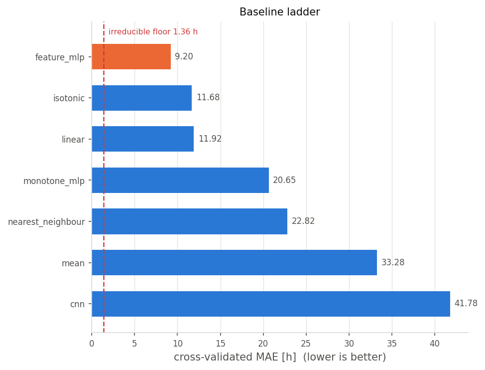
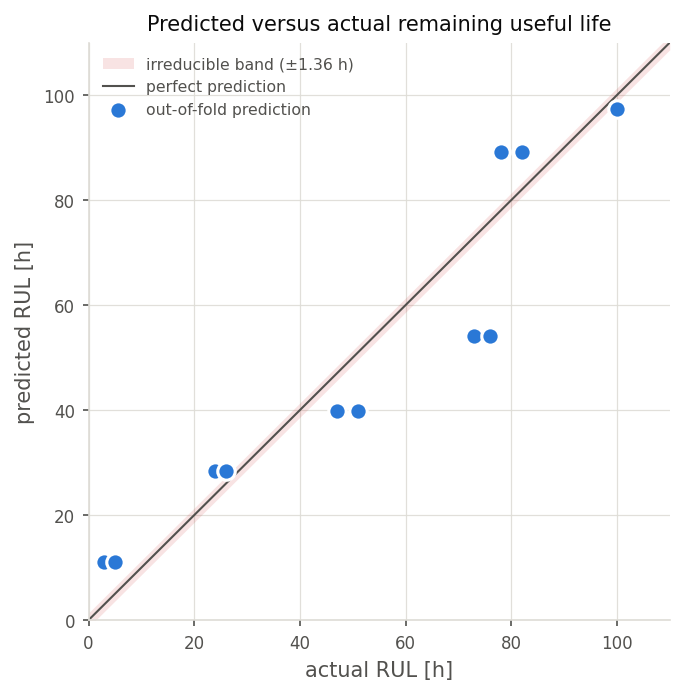
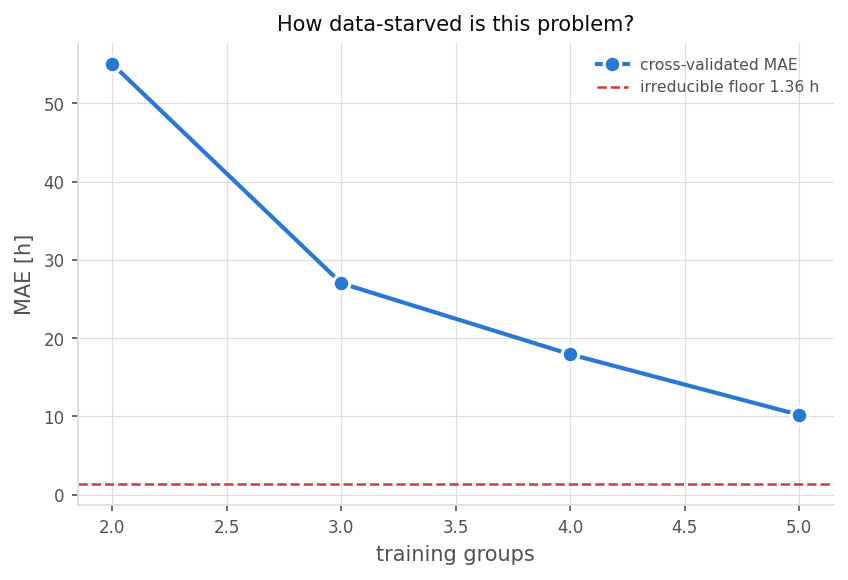
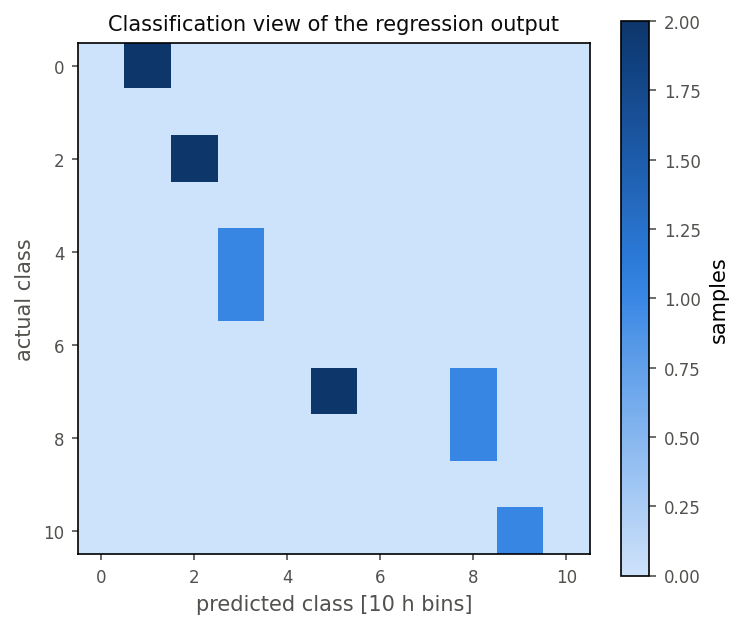

# Predictive Maintenance für Glys-Triebwerke

**Abschließende Projektarbeit — Industrial Computing (DIBSE 26), Teil 2**

Alle Zahlen in diesem Bericht stammen aus [`reports/results.json`](reports/results.json)
und werden von der Pipeline erzeugt, nicht von Hand eingetragen. Reproduktion mit einem
Befehl: `docker compose up`.

---

## 0. Zusammenfassung

Aus einem Wärmebild eines Triebwerks soll die verbleibende Lebensdauer geschätzt werden.
Die Aufgabe wurde als **Regressionsproblem** gelöst (`Dense(1, activation="linear")`,
Verlustfunktion `mse`), zusätzlich wird die Vorhersage in 10-Stunden-Klassen dargestellt.

Der zentrale Befund liegt vor jeder Modellierung: **die 11 Dateien enthalten nur 6
eindeutige Bilder.** Fünf Paare sind byteidentisch, tragen aber unterschiedliche Labels.
Daraus folgt eine beweisbare Fehleruntergrenze von **MAE 1,364 h** und die Notwendigkeit,
alle Datenaufteilungen nach Bildinhalt statt nach Dateiname zu gruppieren.

Das beste Modell erreicht **MAE 9,20 h** (Skill 0,724) in gruppierter
Kreuzvalidierung. Es ist ein neuronales Netz mit 209 Parametern auf einem einzigen
physikalischen Merkmal und schlägt vier Baselines, darunter eine, die eigens die monotone
Physik ausnutzt.

| Modell | MAE [h] | RMSE [h] | R² | Skill |
|---|---:|---:|---:|---:|
| **feature_mlp** | **9,20** | **10,99** | **0,879** | **0,724** |
| isotonic | 11,68 | 13,07 | 0,829 | 0,649 |
| linear | 11,92 | 12,65 | 0,840 | 0,642 |
| monotone_mlp | 20,65 | 24,54 | 0,397 | 0,379 |
| nearest_neighbour | 22,82 | 23,04 | 0,469 | 0,314 |
| mean | 33,28 | 37,82 | −0,432 | 0,000 |
| cnn | 41,78 | 53,50 | −1,866 | −0,256 |

---

## 1. Feature-Extraction (25 %)

### 1.1 Datenaudit: Duplikate und ihre Folgen

Vor jeder Merkmalsberechnung wurden die Dateien nach Inhalt gehasht:

| Dateien | Labels | md5 |
|---|---|---|
| `003h` = `005h` | 3 h, 5 h | `87558f…` |
| `024h` = `026h` | 24 h, 26 h | `4dac2b…` |
| `047h` = `051h` | 47 h, 51 h | `8b2bf8…` |
| `073h` = `076h` | 73 h, 76 h | `bc54a4…` |
| `078h` = `082h` | 78 h, 82 h | `1b3259…` |
| `100h` | 100 h | `c2ee1e…` |

Zwei Konsequenzen bestimmen den Rest der Arbeit.

**Erstens: Datenlecks.** Wird nach Dateinamen aufgeteilt, liegt beim Testen von `005h`
das pixelgleiche `003h` im Trainingssatz. Das ist ein Leck, das keine Metrik anzeigt.
Alle Aufteilungen gruppieren deshalb nach md5-Hash (`dataset.grouped_splits`).

**Zweitens: eine beweisbare Fehleruntergrenze.** Identische Pixel mit verschiedenen Labels
sind durch keine Funktion des Bildes unterscheidbar. Die bestmögliche Vorhersage für ein
Paar ist eine Konstante — der Median minimiert den MAE, der Mittelwert den RMSE:

```
MAE-Untergrenze  = 15   / 11      = 1,364 h
RMSE-Untergrenze = √(24,5 / 11)   = 1,492 h
```

Berechnet zur Laufzeit in `audit.error_floors`, nicht fest verdrahtet. Ein Modell, das
diese Werte unterbietet, hat memoriert oder ein Leck — ein Test bricht den Build ab, falls
das passiert.

**Wie groß der Unterschied ist:** Nearest-Neighbour erreicht **1,36 h** auf den
Trainingsdaten und **22,82 h** in gruppierter Kreuzvalidierung. Faktor 17, allein weil das
Nachschlagen der Antwort unterbunden wird.

### 1.2 Kalibrierung der Temperaturskala

Die Farbskala `temp.png` wird automatisch erkannt und in eine Nachschlagetabelle mit 3685
Einträgen überführt (`colorscale.ColorScale`).

**Falle 1 — Alphakanal.** `temp.png` ist RGBA. Ein naives `.convert("RGB")` rendert
transparente Pixel **schwarz**, und Schwarz ist hier eine gültige Temperatur (0 °C). Der
Fehler zerstört die Kalibrierung lautlos. Alle Bilder werden deshalb zuerst über Weiß
komponiert (`io.load_rgb`, der einzige Ort im Code, der PIL verwendet).

**Falle 2 — Helligkeit ist nicht monoton.** Die Luminanz der Skala steigt bis **189 bei
825 °C** und fällt danach auf **124 bei 1200 °C**. Der heiße Bereich wird über den Farbton
unterschieden, nicht über die Helligkeit. Eine Graustufenumwandlung würde das Signal
zerstören, und die Intuition „heller = heißer" ist oberhalb von 825 °C schlicht falsch.

**Invertierbarkeit wird erzwungen, nicht angenommen.** Eine Nachschlagetabelle ist nur
dann sinnvoll, wenn verschiedene Temperaturen verschiedene Farben haben. `ColorScale`
prüft das bei der Konstruktion und verweigert sonst den Dienst. Gemessen: **maximaler
Rundlauffehler 12,7 °C, keine mehrdeutigen Stützstellen.**

### 1.3 Segmentierung

Die Geometrie ist über den gesamten Datensatz identisch; nur die Farbe ändert sich.
Regionen werden daher über Zusammenhangskomponenten bestimmt und nach der x-Position
sortiert: Einlasskonus, Hauptkörper, Pylon. **Alle 11 Bilder liefern exakt 3 Komponenten**,
ohne Störpixel. Vor der Farbmessung werden die Masken um 4 Pixel erodiert, um
JPEG-Artefakte an den Kanten auszuschließen.

### 1.4 Merkmale — und bewusst ausgeschlossene Merkmale

Pro Region wird der **Median** der Farbe verwendet (robust gegen Restartefakte) und über
die Skala in °C umgerechnet. Ergebnis:

| RUL | Konus | Körper | Pylon | Σ °C |
|---|---:|---:|---:|---:|
| 3 / 5 h | 827 | 1194 | 1194 | 3215 |
| 24 / 26 h | 657 | 827 | 1194 | 2679 |
| 47 / 51 h | 657 | 827 | 827 | 2312 |
| 73 / 76 h | 0 | 657 | 827 | 1485 |
| 78 / 82 h | 0 | 0 | 657 | 658 |
| 100 h | 0 | 0 | 0 | 1 |

Der Datensatz verwendet nur **vier verschiedene Temperaturen**: {0,33 · 657,33 · 827,36 ·
1193,81} °C. Der thermische Zustand ist ein Wort aus drei Symbolen über einem Alphabet mit
vier Buchstaben; 6 von 64 möglichen Zuständen kommen vor. Die Wärme wandert von vorne nach
hinten, der Pylon kühlt zuletzt ab.

**Flächenmerkmale werden berechnet, aber ausgeschlossen.** Da sich die Geometrie nie
ändert, sollten die Flächen konstant sein. Sie sind es fast: die erodierte Konusfläche
nimmt genau drei Werte an — 138 840 px bei 827 °C, 138 802 px bei 657 °C, 137 465 px bei
0 °C. Die Fläche bildet die Temperatur **exakt ab**, weil die Weiß-Schwelle die
kantengeglätteten Ränder heller und dunkler Regionen unterschiedlich behandelt. Ein Modell
könnte daraus die Lebensdauer ableiten — über ein Artefakt des JPEG-Encoders, nicht über
Physik. Die Spalten stehen in `reports/features.csv`, werden aber als degeneriert markiert
und nie trainiert.

---

## 2. Reproduzierbare Umgebung (10 %)

`docker compose up` führt die vollständige Pipeline aus (gemessen 5 min 37 s). Ohne Docker
funktioniert `uv sync && uv run glys-rul reproduce` aus derselben Lockdatei.

**Der Determinismus-Stack.** Jede Maßnahme beseitigt eine dokumentierte Quelle von
Abweichungen:

| Maßnahme | verhindert |
|---|---|
| Basis-Image über Digest gepinnt | stillschweigender Wechsel der Basis |
| Abhängigkeiten aus `uv.lock` | Versionsdrift |
| `platform: linux/amd64` | unterschiedliche Befehlssätze je Host |
| `TF_ENABLE_ONEDNN_OPTS=0` | oneDNN wählt auf AVX2- und AVX-512-Hosts andere Kernel |
| `CUDA_VISIBLE_DEVICES=""` | nichtdeterministische cuDNN-Kernel |
| ein Thread für intra/inter-op | Reihenfolge der Gleitkomma-Reduktion |
| `keras.utils.set_random_seed` + `enable_op_determinism` | Initialisierung, Shuffling |

CPU-Betrieb kostet hier nichts: bei 209 bzw. 25 745 Parametern und 11 Beispielen liegt der
Aufwand im Sekundenbereich.

**Nachgewiesen, nicht behauptet.** Ein Lauf im Container erzeugte eine `results.json`, die
**byteidentisch** zu einem Lauf auf dem Host war — andere Distribution, andere libc,
unabhängig gebaute Wheels. Die CI baut den Container bei jedem Push, führt die Pipeline aus
und schlägt fehl, wenn sich `results.json` um ein einziges Byte unterscheidet.

Damit diese Prüfung überhaupt aussagekräftig ist, sind die Ausgaben getrennt:
`results.json` enthält ausschließlich Metriken, `run_meta.json` die veränderliche Herkunft
(Versionen, Plattform, Git-SHA). Lägen beide in einer Datei, würde die Prüfung bei jedem
Lauf fehlschlagen und wäre wertlos.

**Austauschbare Daten.** Der Mount-Pfad in `compose.yaml` ist kommentiert und zeigt
standardmäßig auf die mitgelieferten Daten. Nichts, was aus den Daten folgt, ist fest
verdrahtet: Fehleruntergrenzen, Gruppenanzahl und Faltungsanzahl werden zur Laufzeit
berechnet. `make validate` prüft den Datenvertrag und meldet Verstöße mit klarer Ursache,
statt still falsche Ergebnisse zu liefern.

---

## 3. Netzarchitektur (15 %)

**Architektur A — Convolutional Neural Network** auf kalibrierten Temperaturkarten
(64 × 64, ein Kanal, °C/1200).

```
3 × [Conv2D(16/32/64, 3×3) · BatchNorm · ReLU · MaxPool] → GlobalAveragePooling
   → Dense(32, relu) → Dense(1, linear)
```

25 745 Parameter. Als Eingabe dient bewusst die **kalibrierte Temperaturkarte** und nicht
das RGB-Bild: so verarbeiten CNN und Merkmalsmodelle dieselbe physikalische Größe, und ein
Unterschied im Ergebnis spiegelt die Architektur wider, nicht die Repräsentation.

**Ergebnis: MAE 41,78 h, Skill −0,256** — schlechter als der Mittelwert. Das war
vorhergesagt und ist ein Befund, kein Versäumnis: die Geometrie ist über alle Bilder
identisch, es gibt kein räumliches Muster, das eine Faltung ausnutzen könnte, und
Global-Average-Pooling verwirft die Position ohnehin. Bei 25 745 Parametern auf 11
Beispielen — 2340 Parameter pro Beispiel — bleibt nur Auswendiglernen.

Zwei Defekte traten beim Messen zutage und wurden behoben:

1. **Divergenz durch Standardisierung.** Die Standardisierung erfolgte pro Merkmalsspalte,
   bei einem Bild also **pro Pixel** über neun Trainingsbeispiele. Hintergrundpixel haben
   eine Streuung von ~1e-8; die Division dadurch erzeugte astronomische Eingaben, das Netz
   divergierte auf MAE 2·10¹³. Temperaturkarten liegen bereits in [0, 1] vor und werden
   nun unverändert durchgereicht.
2. **Augmentation ersetzte statt zu erweitern.** Die Funktion gab dieselbe Anzahl
   transformierter Bilder zurück, das Netz sah also **kein einziges unverändertes
   Beispiel**. Es trainiert jetzt auf den Originalen plus drei augmentierten Runden, was
   den MAE von 47,0 auf 41,8 verbessert.

---

## 4. Alternative Architektur (15 %)

Der Hinweis in der Aufgabenstellung, das zweite Netz müsse kein CNN sein, wurde
aufgegriffen: **Architektur B ist ein dichtes Netz auf numerischen Vektoren.**

```
Dense(16, relu) → Dense(8, relu) → Dense(1, linear)      209 Parameter
```

**Ergebnis: MAE 9,20 h, Skill 0,724** — das beste Modell der Arbeit.

Ein Ergebnis war dabei überraschend und widerlegte die eigene Erwartung. Naheliegend wäre,
dem Netz alle drei Regionstemperaturen zu geben, da sie strikt mehr Information enthalten
als ihre Summe. Gemessen:

| Eingabe | MAE [h] | Streuung über Seeds |
|---|---:|---:|
| nur Σ °C | **10,93** | 0,41 |
| drei Regionen | 33,97 | **5,13** |

Mit drei Merkmalen ist das Netz **schlechter als der Mittelwert** und extrem instabil. Bei
elf Beispielen ist die Summe eine physikalisch motivierte Dimensionsreduktion, die stärker
regularisiert als alles, was der Optimierer lernen könnte. Merkmalsentwurf schlägt hier
Modellkapazität.

**Monotone Variante.** Zusätzlich wurde ein Netz mit nichtnegativen Gewichten auf einer
negierten Eingabe umgesetzt. Es ist strukturell garantiert monoton fallend in der
Temperatur: ein heißeres Triebwerk kann nie mehr Restlebensdauer erhalten, auch bei
Extrapolation. Nachgewiesen an 200 zufälligen Paaren nach dem Training; das unbeschränkte
Netz verletzt die Eigenschaft auf denselben Paaren.

Die Garantie kostet Genauigkeit (20,65 h gegenüber 9,20 h), halbiert aber die Streuung über
Seeds — auf drei Merkmalen 0,24 statt 5,13. Für einen sicherheitsrelevanten Einsatz ist
das ein vertretbarer Tausch, für die reine Punktgenauigkeit nicht.

---

## 5. Trainingseinstellungen (15 %)

| Einstellung | Wert | Begründung |
|---|---|---|
| Verlustfunktion | `mse` | wie in der Aufgabenstellung für Regression vorgegeben |
| Ausgabeschicht | `Dense(1, activation="linear")` | ebenso vorgegeben |
| Optimierer | Adam, lr 1e-3 | Standard, nicht auf Testdaten abgestimmt |
| Zielskalierung | RUL / 100 | hält den Verlust in einem stabilen Bereich |
| Batchgröße | voller Datensatz | bei 9–10 Trainingsbeispielen ist alles andere künstlich |
| Kreuzvalidierung | Leave-One-Group-Out über 6 Hash-Gruppen | siehe §1.1 |
| Seeds | 5 Seeds, Mittelwert ± Streuung | Einzelläufe sind bei n = 11 reines Rauschen |
| Early Stopping | **keines** | siehe unten |

**Kein Early Stopping — und warum das die ehrlichere Wahl ist.** Bei Leave-One-Group-Out
enthält jede Faltung genau eine ausgelassene Gruppe. Ein Abbruchkriterium darauf zu stützen
hieße, die Testdaten in die Trainingsentscheidung einzubeziehen. Das Epochenbudget wurde
deshalb vorab festgelegt und nicht anhand der ausgelassenen Faltung angepasst.

**Standardisierung und Zielskalierung werden innerhalb der Faltung geschätzt.** Über den
gesamten Datensatz berechnete Statistiken trügen bei elf Beispielen einen sichtbaren
Abdruck der ausgelassenen Gruppe.

**Augmentation — und was hier verboten ist.** Farbe *ist* das Label. Helligkeits-,
Kontrast-, Farbton- und Gamma-Variation würden das Beispiel nicht augmentieren, sondern
**stillschweigend umetikettieren**. Zulässig sind ausschließlich geometrische
Transformationen (Verschiebung, Skalierung, kleine Rotation) und Messfehler (additives
Sensorrauschen, kleiner Kalibrierungsversatz). Horizontales Spiegeln ist ausgeschlossen, da
es Konus und Pylon vertauscht.

---

## 6. Analyse der Schätzgenauigkeit (20 %)

### 6.1 Baseline-Leiter

Jede Stufe beantwortet einen konkreten Einwand gegen das neuronale Ergebnis.

| Stufe | Frage | MAE [h] |
|---|---|---:|
| Mittelwert | Wie sieht „kein Können" aus? | 33,28 |
| Nearest Neighbour | Ist es bloßes Nachschlagen? | 22,82 |
| Lineare Regression | Genügt ein Parameter? | 11,92 |
| Isotone Regression | Schließt die monotone Physik die Lücke? | 11,68 |
| **feature_mlp** | **Schlägt ein gelerntes Modell die geschlossene Form?** | **9,20** |

Bemerkenswert ist der Abstand zwischen linearer und isotoner Regression auf demselben
einzelnen Merkmal: der Zusammenhang ist monoton, aber deutlich nichtlinear.



### 6.2 Ergebnisse gegen die Fehleruntergrenze



Das schmale rote Band ist die erreichbare Genauigkeit (±1,36 h). Es ist gegen die
tatsächlichen Fehler kaum sichtbar — genau das ist die Aussage.

**Woher der verbleibende Fehler stammt.** Die Untergrenze begrenzt, was angesichts der
*Labels* möglich ist. Eine zweite Grenze folgt daraus, dass nur **sechs verschiedene
Zustände** existieren: jede Faltung trainiert auf fünf und muss den sechsten vorhersagen.
Für innere Zustände ist das Interpolation, für die beiden Randzustände Extrapolation über
alles Gesehene hinaus.

| Faltungen | MAE [h] |
|---|---:|
| Randgruppen (3/5 h und 100 h) | 20,67 |
| innere Gruppen | 8,31 |

Bei ausgelassener 3-Stunden-Gruppe kennt das Modell nichts Heißeres als 24 h und sagt 25 h
vorher; bei ausgelassener 100-Stunden-Gruppe nichts Kühleres als 82 h und sagt 80 h vorher.

### 6.3 Kontrollexperiment mit permutierten Labels

Werden die Labels zufällig vertauscht, erreicht das Modell **34,46 h** gegenüber einem
Nullniveau von **33,28 h** — also minimal *schlechter* als Raten. Es bleibt kein Restsignal
zum Auswendiglernen übrig. Das Ergebnis von 9,20 h ist damit gemessenes Können und keine
Memorierung.

### 6.4 Lernkurve



| Trainingsgruppen | 2 | 3 | 4 | 5 |
|---|---:|---:|---:|---:|
| MAE [h] | 55,0 | 27,0 | 17,9 | 10,2 |

Steil fallend, ohne Anzeichen einer Sättigung. Jeder zusätzliche thermische Zustand
halbiert den Fehler etwa. Der verbleibende Fehler ist damit vor allem ein Datenproblem und
kein Modellproblem — die wichtigste Aussage für die Frage, wie es weitergehen sollte.

### 6.5 Klassifikationssicht



Dieselben Vorhersagen, in 10-Stunden-Klassen eingeteilt. Die Matrix ist dünn besetzt, weil
elf Beispiele auf zehn Klassen entfallen — was gleichzeitig zeigt, warum ein direkt
trainierter Klassifikator hier die schlechtere Wahl gewesen wäre.

### 6.6 Prognoseintervalle

Statt eines Punktwerts liefert das System ein Intervall aus dem Jackknife+-Quantil der
Out-of-Fold-Residuen: bei 90 % Zielabdeckung eine Halbbreite von **21,95 h**. Das ist
breit, aber ehrlich — und mit der Endlichkeitskorrektur `(n+1)/n` bei sechs Residuen
tatsächlich gültig statt nur asymptotisch.

### 6.7 Grenzen des Modells

- Es kennt **sechs** thermische Zustände; zwischen ihnen wird interpoliert, darüber hinaus
  extrapoliert. Die interaktive Demo kennzeichnet Eingaben außerhalb des beobachteten
  Bereichs ausdrücklich.
- Die Vorhersage hängt vollständig davon ab, dass die Farbkalibrierung gültig bleibt.
- Das beste Modell liest die **Summe** der Temperaturen. Die Aufschlüsselung nach Regionen
  ist diagnostisch wertvoll, geht aber nicht in die Schätzung ein.
- Jenseits von 100 h liegen keine Daten vor; Aussagen dort sind unbegründet.

---

## 7. Optimierungskampagne

Die Kampagne (`docker compose --profile search run --rm search`) durchsucht die
Architekturfamilien mit Optuna und protokolliert **jeden** Versuch nach
`reports/experiments.csv` — auch die gescheiterten und die schlechten. Ein Protokoll, das
nur Erfolge enthält, kann eine gründliche Suche nicht von einer glücklichen unterscheiden.

Durchsuchte Achsen: Eingaberepräsentation (Summe gegen drei Regionen), Tiefe und Breite,
Lernrate, L2-Regularisierung, Epochenbudget, Verlustfunktion (`mse` gegen `huber`), für das
CNN zusätzlich Filterzahl, Dropout und Augmentationsstärke.

### 7.1 Ergebnisse — 42 Versuche, 42 erfolgreich

| Familie | bester MAE [h] | Median | Versuche |
|---|---:|---:|---:|
| feature_mlp | **8,05** | 12,19 | 14 |
| monotone_mlp | 12,56 | 15,89 | 14 |
| cnn | 24,87 | 30,33 | 14 |

| Eingaberepräsentation | bester MAE | Median | Versuche |
|---|---:|---:|---:|
| Σ °C (Summe) | **8,05** | **12,71** | 16 |
| drei Regionstemperaturen | 14,55 | 22,10 | 12 |

**Alle zehn führenden Konfigurationen verwenden die Summe.** Die drei getrennten
Temperaturen enthalten strikt mehr Information und schneiden strikt schlechter ab — die in
§4 aus drei Seeds gewonnene Beobachtung ist damit durch eine systematische Suche bestätigt.

Auch das CNN bekam eine faire Chance: 14 eigene Versuche verbesserten es von 41,8 auf
24,9 h. Sein schwaches Abschneiden liegt also nicht an schlecht gewählten
Hyperparametern — es bleibt deutlich hinter einer ungetunten linearen Regression zurück.

### 7.2 Ehrlich gegen getunt

| | MAE [h] | |
|---|---:|---|
| Berichtetes Ergebnis | **9,20** | Konfiguration **vor** der Suche festgelegt |
| Bester Kampagnenwert | 8,05 | Konfiguration **durch** den berichteten Wert ausgewählt |

Als Ergebnis wird bewusst 9,20 h berichtet und nicht 8,05 h. Der Kampagnenbestwert wurde
mit derselben Kreuzvalidierung ausgewählt, mit der er bewertet wird; ihn als Ergebnis
auszugeben wäre ein Selektionsfehler, der bei sechs effektiven Beispielen nicht klein ist.
Die Differenz von 1,15 h ist selbst ein Messwert dafür, wie stark Tuning ein Modell bei
dieser Stichprobengröße schmeichelt.

---

## 8. Fazit

Die Aufgabe ließ sich nicht dadurch lösen, ein möglichst großes Netz auf die Bilder zu
werfen. Entscheidend war, den Datensatz zuerst zu verstehen: 11 Dateien sind 6 Bilder, die
Farbskala ist nicht helligkeitsmonoton, und die Flächenmerkmale verraten die Temperatur
über ein Encoder-Artefakt.

Aus dieser Analyse folgte alles Weitere — Gruppierung nach Bildinhalt, eine beweisbare
Fehleruntergrenze als Bezugsgröße, das Verbot photometrischer Augmentation und die
Erkenntnis, dass ein Netz mit 209 Parametern auf einem einzigen physikalisch motivierten
Merkmal ein CNN mit 25 745 Parametern deutlich schlägt.

Das Ergebnis von **9,20 h MAE** liegt weit über der Untergrenze von 1,364 h. Die Lernkurve
zeigt, warum: mit sechs unterscheidbaren Zuständen ist die Aufgabe datenbegrenzt, nicht
modellbegrenzt. Die ehrlichste Empfehlung an die Glys lautet daher nicht „ein größeres
Netz", sondern **mehr thermische Zustände messen**.
